<p align="center">
  
</p>

<p align="center">
  A SCARA robotic arm designed to solve the Tower of Hanoi using computer vision.
</p>

<p align="center">
  
  
  
  
</p>


# SCARA Arm - Solving Hanoi Tower

The SCARAnoi project aims to design and build a SCARA robot arm capable of solving the Tower of Hanoi problem using computer vision and autonomous manipulation.

The system combines a mechanically designed SCARA arm, a vertical motion axis, a parallel-jaw gripper, a Hanoi platform with three pegs and multiple disks, and a camera-based detection pipeline. The robot detects the position and size of the disks, determines the current configuration of the puzzle, computes the required sequence of moves, and executes the corresponding pick-and-place actions. It is designed to solve standard Tower of Hanoi configurations and to handle intermediate or non-standard configurations by recomputing the solution from the detected state.

Beyond the final demo, the project is meant to be reusable and extensible. The mechanical subsystems, perception pipeline, and motion control logic are separated as much as possible so that anyone can improve individual parts of the project without redesigning the entire system from scratch.

Enjoy building!


# Table of Contents

- [Autonomous Hanoi Solving](#autonomous-hanoi-solving)
- [How to Build](#how-to-build)
  - [Prerequisites](#prerequisites)
- [Hardware](#hardware)
  - [Base](#base)
  - [Arm](#arm)
  - [Gripper](#gripper)
  - [Hanoi Platform and Camera Support](#hanoi-platform-and-camera-support)
- [Electronics](#electronics)
- [Software](#software)
  - [Laptop or Server Software](#laptop-or-server-software)
  - [ESP32 Firmware](#esp32-firmware)
  - [Arduino Firmware](#arduino-firmware)
- [Motion](#motion)
  - [Shoulder and Elbow Motion](#shoulder-and-elbow-motion)
  - [Z-Axis Motion](#z-axis-motion)
  - [Gripper Motion](#gripper-motion)
  - [Homing and Limits](#homing-and-limits)
- [Computer Vision](#computer-vision)
- [Hanoi Algorithm](#hanoi-algorithm)
- [Autonomous Operation](#autonomous-operation)
- [Manual Control](#manual-control)
- [Bill of Materials](#bill-of-materials)
  - [Electrical Components](#electrical-components)
  - [Mechanical Components](#mechanical-components)
- [Possible Improvements](#possible-improvements)
- [Top contributors](#top-contributors)


# Autonomous Hanoi Solving

This video shows the SCARAnoi robot solving the Tower of Hanoi problem autonomously. The system detects the initial disk configuration, computes the sequence of moves, and commands the SCARA arm to pick and place the disks according to the rules of the puzzle.

[Insert demo video here.]


# How to Build

## Prerequisites

Before starting the build, make sure you have access to the fabrication tools needed for both the mechanical structure and the electronics. SCARAnoi is not only a 3D-printed robot: it also uses laser-cut MDF parts, rods, bearings, belts, motors, wiring, and embedded electronics. A small mechanical workshop setup is therefore very useful.

### 3D Printer

A 3D printer is needed for most of the custom mechanical parts of the robot. This includes parts of the SCARA arm, the gripper frame, the racks and pinion, the jaw holders, the jaws, the Hanoi disks, pulley adapters, spacers, and other small mechanical interfaces.

Most of the 3D-printed parts of SCARAnoi were made in PETG. TPU was used only for the side contact pieces of the gripper jaws. These softer pieces improve contact with the disks and help prevent slipping during pick-and-place movements.


### Laser Cutter

A laser cutter is required for the flat MDF structure of the robot. 

Make sure the MDF thickness matches the design files. If the material thickness is different, the slots may become too loose or too tight and the assembly may need to be adjusted.

### Soldering Equipment

Soldering equipment is needed for the electrical part of the robot. The system includes stepper motors, limit switches, an ESP32-CAM, a servo motor, buck converters, an Arduino Mega, and a RAMPS 1.4 board.

Heat-shrink tubing, connectors, and proper cable management are strongly recommended to avoid loose contacts, short circuits, or communication issues between the ESP32 and the Arduino.

### Mechanical Tools

Basic mechanical tools are required for assembling and adjusting the robot. 

Some parts may need small manual adjustments after fabrication. For example, rods may need to be cut to length, holes may need to be cleaned, and bearings or shafts may need to be fitted carefully.

Pay special attention to the moving assemblies. The Z-axis rods, lead screw, shoulder rotation, belts, pulleys, and gripper racks should move smoothly without excessive friction. Small alignment errors can create noise, wobbling, or missed steps during motion.

### Drill

A drill is useful for preparing or adjusting holes in MDF and 3D-printed parts. 

Be careful when drilling 3D-printed parts. If a hole becomes too large, the part may no longer hold screws, rods, or bearings firmly.

### Computer

A laptop or desktop computer is required to program and control the system. It is used to flash the Arduino firmware, program the ESP32-CAM, run the computer vision code, use the manual control interface, and test the autonomous Hanoi solver.


# Hardware

The hardware of the SCARAnoi project is composed of a SCARA robot arm designed to solve the Tower of Hanoi problem. The system consists of a base, a two-segment arm, a gripper, and a Hanoi platform with camera support.
The structure is divided into four main mechanical assemblies:

- Base
- Arm
- Gripper
- Hanoi Platform and Camera Support

The full mechanical assembly is available here: [Full SCARAnoi assembly design](docs\CAD\Full-Assembly\FinalAssemblySCARAnoi.step).

## Base

Base full assembly : [Base-Assembly-STEP-file](docs/CAD/Base/Assembly/base-assembly.step)

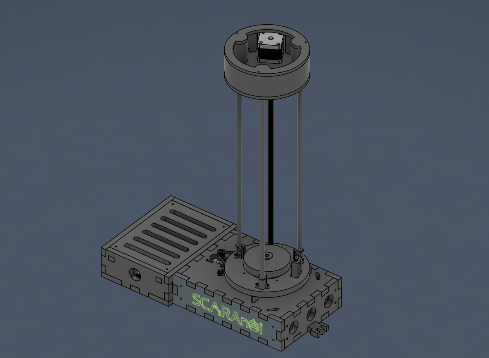

The base is the main structural support of SCARAnoi. It holds the vertical Z-axis mechanism, supports the rotating shoulder platform, and keeps the robot stable while the arm is moving.

The final version was redesigned as a laser-cut MDF structure with an attached electrical box. This box keeps the electronics accessible during debugging and integration, without needing to open the whole mechanical base every time.

The rotating shoulder platform is mounted on top of the moving Z-axis platform and forms the first rotational joint of the SCARA arm. It is driven by a GT2 belt transmission between a 20-tooth pulley and a 160-tooth pulley. This reduction increases the available torque at the shoulder, which is important because this joint carries the rest of the arm.

### Files to Laser Cut

- [Main base wide side plates x2](docs/CAD/Base/Laser-cut/SideBox-2.dxf)
- [Main base side plate x1](docs/CAD/Base/Laser-cut/SideBox-1.dxf)
- [Main base side plate attached to electrical box x1](docs/CAD/Base/Laser-cut/SideBoxH-1.dxf)
- [Main base top plate x1](docs/CAD/Base/Laser-cut/TopBox.dxf)
- [Main base bottom plate x1](docs/CAD/Base/Laser-cut/BotBox.dxf)
- [Electrical box side plates x2](docs/CAD/Base/Laser-cut/SideElec-2.dxf)
- [Electrical box side plate plug holes x1](docs/CAD/Base/Laser-cut/SideElec-PH.dxf)
- [Electrical box side plate attached to main base box x1](docs/CAD/Base/Laser-cut/SideElecH-1.dxf)
- [Electrical box cover x1](docs/CAD/Base/Laser-cut/TopElec.dxf)
- [Electrical box bottom plate x1](docs/CAD/Base/Laser-cut/BotElec.dxf)
- [Electrical box cover holders x4](docs/CAD/Base/Laser-cut/MountingElec-4.dxf)
- [Upper lift mounting plate x1](docs/CAD/Base/Laser-cut/ShoulderBase.dxf)

### Files to 3D Print

- [Shoulder platform x1](docs/CAD/Base/3D-print/Platform.stl)
- [Shoulder 160 teeths pulley x1](docs/CAD/Base/3D-print/Pulley160T.stl)
- [Shoulder platform cover x1](docs/CAD/Base/3D-print/Cover.stl)
- [Rod clamp supports x3](docs/CAD/Base/3D-print/SmoothRod_Clamp.stl)
- [Limit switch holder base x1](docs/CAD/Base/3D-print/SwitchHolderPlatform.stl)
- [Limit switch holder shoulder x1](docs/CAD/Base/3D-print/SwitchHolderShoulder.stl)
- [Upper lift assembly side panel x1](docs/CAD/Base/3D-print/UpperLiftSide.stl)
- [Upper lift assembly cover plate x1](docs/CAD/Base/3D-print/UpperLiftCover.stl)
- [Mounting blocks x8](docs/CAD/Base/3D-print/Mounting.stl)
- [Limit switch actuators x2](docs/CAD/Base/3D-print/LimitSwitchActuator.stl)

### Bill of Materials

| Part | Quantity | Specification / Notes |
|---|---:|---|
| Smooth rods | 3 | 8 mm diameter, 420 mm length |
| T8 lead screw | 1 | 8 mm diameter, 400 mm length |
| Axial ball bearings | 2 | 50 mm inner diameter, 70 mm outer diameter, 14 mm width |
| Deep groove ball bearing | 1 | 10 mm inner diameter, 30 mm outer diameter, 9 mm width |
| Deep groove ball bearing | 1 | 8 mm inner diameter, 22 mm outer diameter, 7 mm width |
| GT2 belt | 1 | 6mm width, 400 mm length |
| GT2 pulley | 1 | 20-tooth motor pulley (or 16 to have a perfect 1:10 ratio) |
| Shaft coupler | 1 | 5 mm to 8 mm |
| Nema-17 Stepper motor | 2 | For the Z-axis vertical motion and the shoulder rotation|
| MDF sheet 10mm| 1 | For the box |
| MDF sheet 6mm| 1 | For the NEMA motor mounting plate |
| M2.5, M3 and M4 screws | As needed | For mechanical attachments |
| M2.5, M3 and M4S Heat inserts | As needed | For mechanical attachments |
| M10 Screw, Nut and washer | 1 | For fixing the shoulder to the base |
| Limit switches | 4 | For homing the shoulder and Z axis |

### Assembly Procedure

<p align="center">
  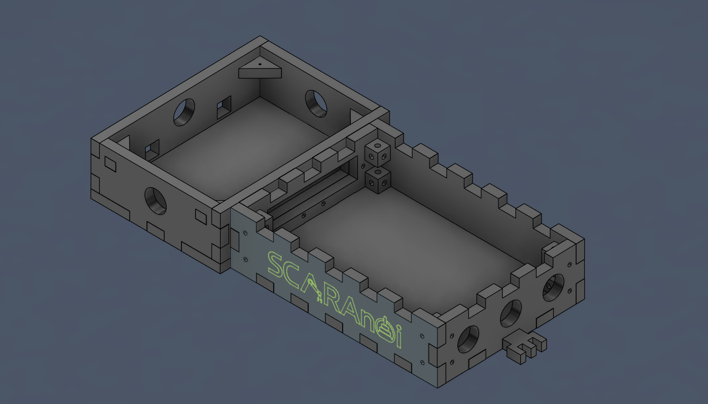
  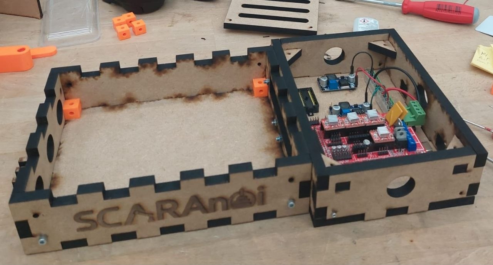
</p>
Laser cut the MDF parts for the main base and the attached electrical box. Start by assembling the main SCARA base with the finger joints. This base should not be permanently sealed, since some internal parts may still need to be accessed later, for example to tighten the shoulder screw or rearrange wires going through it. To make the side panels removable, we used small 3D-printed mounting blocks inside the base corners. Each block contains two M4S heat-set inserts, one for each adjacent side panel. The blocks are glued to the inner face of a horizontal panel, and the side panels are screwed into them using M4×12 screws. This keeps the base rigid while still allowing it to be opened if needed.

The electrical box is assembled separately. Its side and bottom panels can be glued normally, since it remains accessible from its own opening. Once assembled, attach it to the main base using M4 screws. 

Do not install the top face of the main SCARA base yet. Keeping the top open makes it easier to mount the Z-axis motor, the shoulder platform, the belt transmission, and the screw/nut assembly. If the top face is installed too early, it will probably need to be removed again.

<p align="center">
  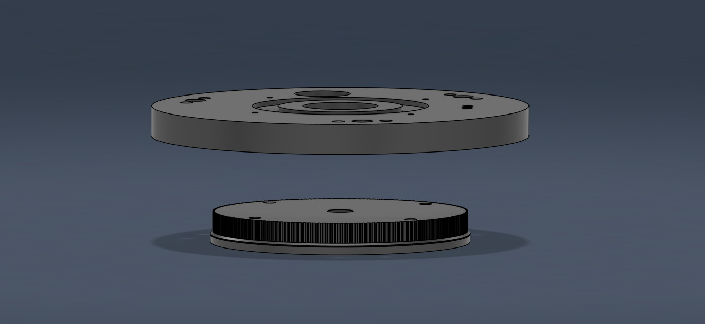
  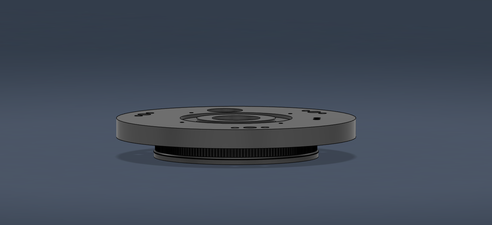
</p> 
Attach the shoulder platform to the 160-tooth pulley using four M2.5×12 screws. The two parts were printed separately to make iteration easier: if one part has a defect or needs a design change, only that part has to be reprinted. Insert four M2.5 heat-set inserts into the pulley, then screw the pulley to the shoulder platform.

Insert two M3 heat-set inserts for each rod clamp into the shoulder platform, for a total of six inserts. Place the three rod clamps and attach them using M3×12 screws.

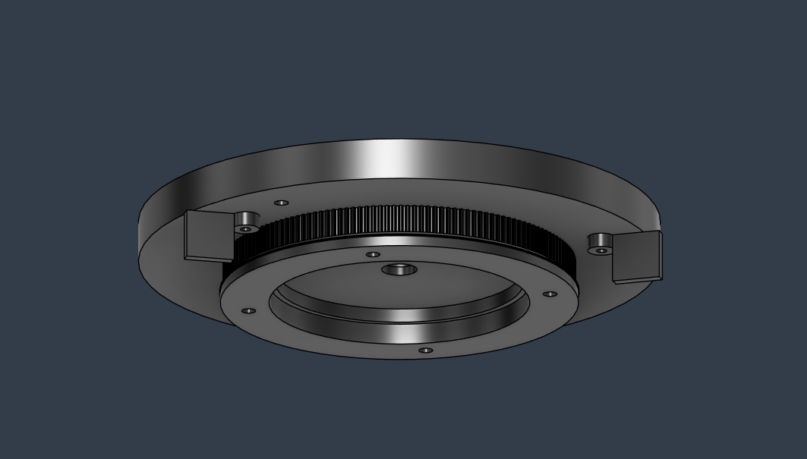

The insert holes for the rod clamps pass through the shoulder platform. Flip the platform and reuse two accessible holes to mount the limit switch actuators. Avoid the clamp located on the belt side. Insert the heat-set inserts from the opposite side, then attach the two actuators using one M3×12 screw each.

<p align="center">
  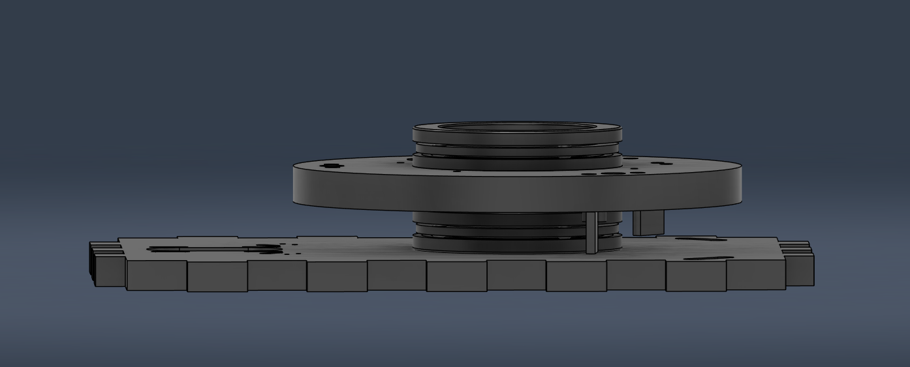
  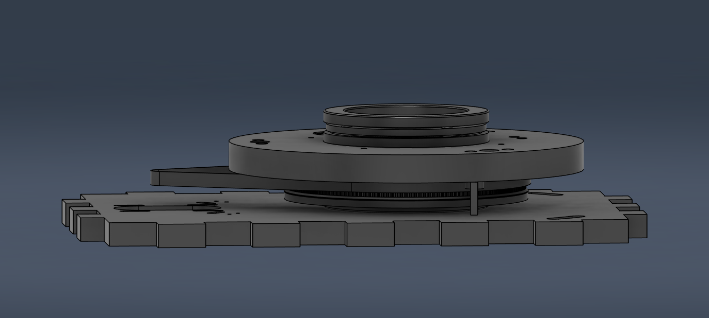
</p>

Next, assemble the shoulder rotation stack. Place one axial ball bearing on the box top face, centered around the 10 mm hole. Before placing the shoulder platform, put the belt around the 160-tooth pulley so it is already in position for the belt transmission. Seat it then on the bearing, making sure the bearing fits correctly into the circular recess at the bottom of the pulley.

<p align="center">
  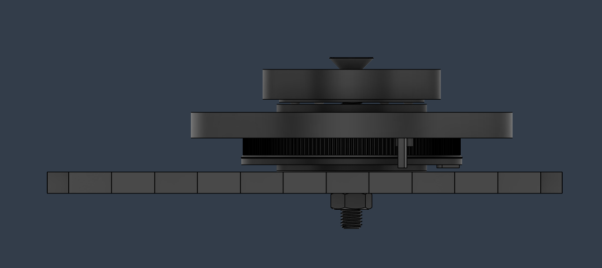
  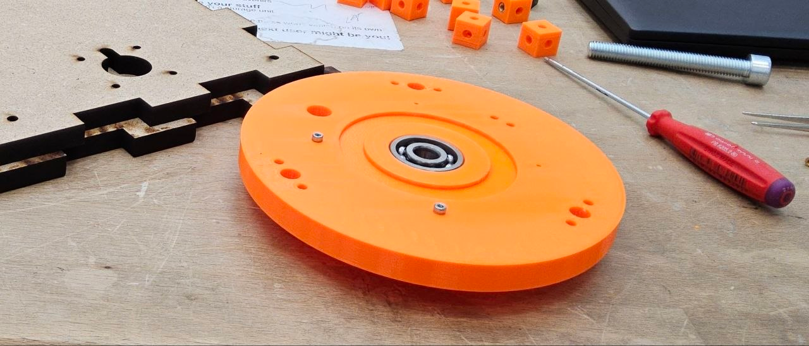
</p>

Place the 10x30x9 ball bearing inside the hole at the center top of the platform, then place the second axial bearing in the circular recess on top of it and add the shoulder platform cover. Align the 10 mm holes of the shoulder platform, pulley, bearings, and base top face. Insert the M10 screw from the top, through the full stack, until it comes out under the base top face. Add the washer and M10 nut from below, then tighten carefully. The stack should have no excessive play, but the shoulder must still rotate freely without too much friction.

Once the shoulder stack is assembled, adjust the belt transmission. Place the shoulder NEMA motor in the slots of the base top face and attach the 20-tooth pulley to the motor shaft. Pass the belt around both pulleys, then slide the motor in the slots to set the belt tension. The belt should be tight enough to avoid skipping, but not so tight that it makes rotation difficult. When the tension is correct, fix the motor using four M3×12 screws.

Before closing the main base, it is better to install and wire the three limit switches. This can still be done later, but the top face would need to be removed again. Two limit switches are mounted directly on the main base using M2 screws and nuts. If the screws are not long enough, drill the mounting holes slightly deeper.

The third limit switch is mounted on the shoulder platform. First screw it to its holder using two M2 screws, then attach the holder to the shoulder platform using two M2.5 screws. For this, insert two M2.5 heat-set inserts into the corresponding holes in the shoulder platform. Route the limit switch wires through the nearest hole in the main base, then pass them together with the motor wires through the opening between the main base and the electrical box.

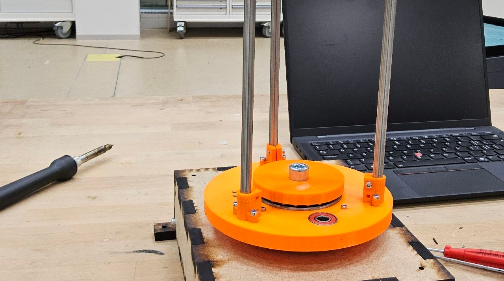

After this, close the main SCARA base by installing the top face. Then install the three 8 mm smooth rods vertically. Place the 8x22x7 ball bearing into its matching hole in the platform, insert each rod into its clamp support and tighten it using two M3 screws. These rods guide the moving shoulder platform during Z-axis motion and prevent it from tilting, so they should be as parallel as possible. If they are misaligned, the platform may create friction or get stuck.

<p align="center">
  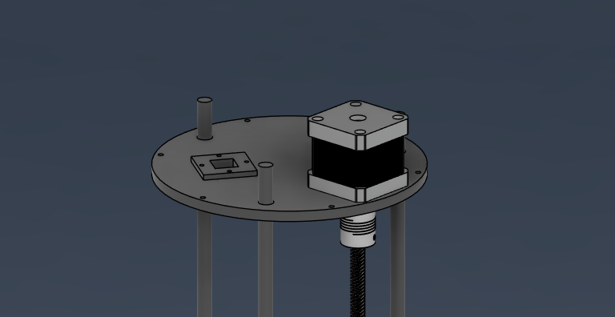
  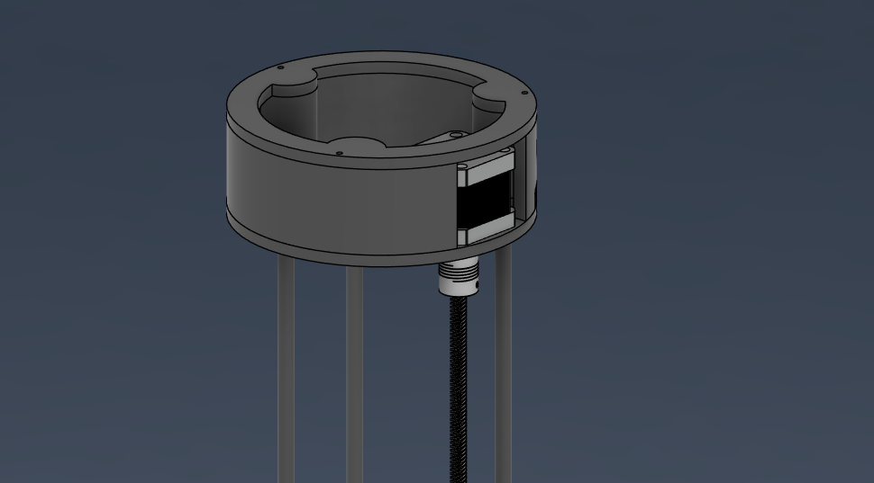
</p>

Next, assemble the upper lift. Insert M3 heat-set inserts into the top and bottom screw holes of the upper lift side panel. Screw the side panel to the 6 mm MDF upper lift mounting plate. Place the Z-axis NEMA motor in the corresponding slot, screw it in place, and attach the shaft coupler to the motor shaft. Then screw the upper lift cover plate to the top of the side panel.

Connect the T8 lead screw to the free side of the shaft coupler. Then place the 8x22x7 ball bearing into its matching hole in the platform, insert the three 8 mm smooth rods into their corresponding holes in the upper lift cover plate and finally guide the lead screw through the bearing. 

To mount the arm, the upper lift cover plate will need to be removed temporarily so the arm can be inserted onto the rods.

## Arm

Arm full assembly : [Arm-Assembly-STEP-file](docs/CAD/Arm/Assembly/arm-assembly.step)

The arm is the main kinematic structure of the SCARA robot. It consists of two rigid segments connected by rotational joints. Each joint is driven independently, giving the robot two degrees of freedom for horizontal motion. This allows the gripper to freely reach any object in a radius less than the combined length of the arms.<br>
- The floor and ceiling of each of the arm segments are made using laser-cut 6mm thick MDF. The rest of the parts are made using 3d-printed parts, they include bearing holders, bearing covers, pulleys and pillars.
- Each of the rotation axes (which we named Y for the elbow segment and E for the gripper) is supported by 2 bearings to ensure no undesirable play and proper transmission for the E rotation.
- Each rotation is also limited by 2 limit switches that have approximately an 80 degree angle between them. The effective dead zone can be tuned depending on the piece interfacing with the switches.
- Both rotation axes have a 3.2:1 pulley ratio. This can be changed by printing pulleys with more teeth or choosing the motor pulleys with less teeth.

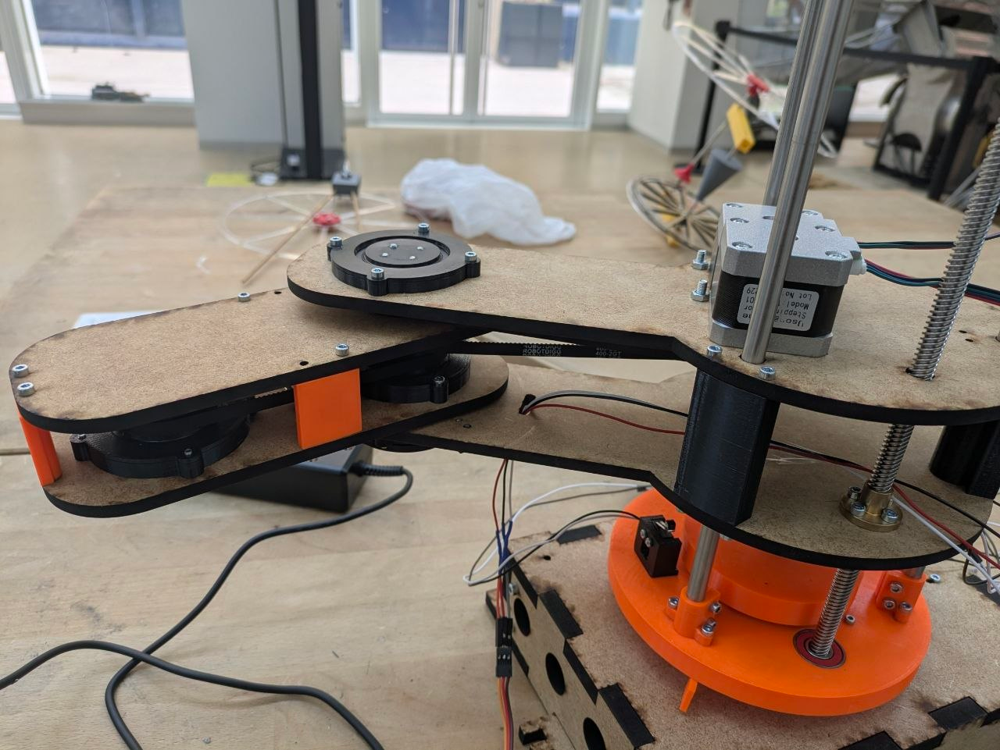

### Files to Laser Cut

- [Inner arm ceiling](docs/CAD/Arm/Laser-cut/inner-arm/inner-ceiling.dxf)
- [Inner arm floor](docs/CAD/Arm/Laser-cut/inner-arm/inner-floor.dxf)
- [Motor holder](docs/CAD/Arm/Laser-cut/inner-arm/motor-holder.dxf)
- [Outer arm ceiling](docs/CAD/Arm/Laser-cut/outer-arm/outer-ceiling.dxf)
- [Outer arm floor](docs/CAD/Arm/Laser-cut/outer-arm/outer-floor.dxf)

### Files to 3D Print

#### Inner arm pieces

- [Inner arm cover 1](docs/CAD/Arm/3D-print/inner-arm/inner-cover1.stl)
- [Inner arm cover 2](docs/CAD/Arm/3D-print/inner-arm/inner-cover2.stl)
- [Inner arm cover 3](docs/CAD/Arm/3D-print/inner-arm/inner-cover3.stl)
- [Inner arm housing cover1](docs/CAD/Arm/3D-print/inner-arm/inner-housing-cover1.stl)
- [Inner arm housing cover2](docs/CAD/Arm/3D-print/inner-arm/inner-housing-cover2.stl)
- [Inner arm housing 1](docs/CAD/Arm/3D-print/inner-arm/inner-housing1.stl)
- [Inner arm housing 2](docs/CAD/Arm/3D-print/inner-arm/inner-housing2.stl)
- [Inner pillar 1](docs/CAD/Arm/3D-print/inner-arm/inner-pillar1.stl)
- [Inner pillar 2](docs/CAD/Arm/3D-print/inner-arm/inner-pillar2.stl)
- [Inner pillar 3](docs/CAD/Arm/3D-print/inner-arm/inner-pillar3.stl)
- [Inner pulley](docs/CAD/Arm/3D-print/inner-arm/inner-pulley.stl)

#### Outer arm pieces

- [Outer arm cover 1](docs/CAD/Arm/3D-print/outer-arm/outer-cover1.stl)
- [Outer arm cover 2](docs/CAD/Arm/3D-print/outer-arm/outer-cover2.stl)
- [Outer arm housing cover1](docs/CAD/Arm/3D-print/outer-arm/outer-housing-cover1.stl)
- [Outer arm housing cover2](docs/CAD/Arm/3D-print/outer-arm/outer-housing-cover2.stl)
- [Outer arm housing 1](docs/CAD/Arm/3D-print/outer-arm/outer-housing1.stl)
- [Outer arm housing 2](docs/CAD/Arm/3D-print/outer-arm/outer-housing2.stl)
- [Outer pillar 1](docs/CAD/Arm/3D-print/outer-arm/outer-pillar1.stl)
- [Outer pillar 2](docs/CAD/Arm/3D-print/outer-arm/outer-pillar2.stl)
- [Outer pillar 3](docs/CAD/Arm/3D-print/outer-arm/outer-pillar3.stl)
- [Outer pulley 1](docs/CAD/Arm/3D-print/outer-arm/outer-pulley1.stl)
- [Outer pulley 2](docs/CAD/Arm/3D-print/outer-arm/outer-pulley2.stl)

### Other Parts

| Part | Quantity | Specification / Notes |
|---|---:|---|
| NEMA 17 stepper motors | 2 | 17hs4401  |
| GT2 aluminium Timing pulley| 2 | 20 Teeth |
| M3 Threaded heat inserts | 12 |  |
| Deep Groove Ball Bearing 6906 / 61906 RS | 4 | 30x47x9mm |
| GT2 6mm wide Timing belt | 2 | 400m long |
| GT2 6mm wide Timing belt | 1 | 350m long |
| LM6UU Linear Bearing | 4 | 6mm |
| TR8 Trapezoidal Nut Brass | 1 | 8mm pitch |

### Assembly Procedure

- Screw the motor holder to the inner arm ceiling using M4 screws and nuts. Then mill the housing holes in the inner arm floor with a drill and milling head, for the purpose of using countersunk screws. Also drill the holes of the microswitch holes about 2mm down (unless you can get M2 screws longer or equal to 14mm).<br>
- For each of the bearings, insert them inside the housing and then put the housing cover on top, then screw these assemblies to their corresponding floor or ceiling. Beware that the lower bearing assembly is upside down and screwed with countersunk screws. Make sure you get the right housing for the bearings, the outer arm housings are slightly taller than the inner arm housings. Also for the assembly with the double pulley, you need to put together the cover pieces of the inner arm first as told next.<br>
- The outer arm ceiling holes that interface with the inner arm need to be drilled to allow the screw heads to fit in, otherwise they rub against the outer arm first pulley, which can prevent the arm from moving slowly. <br>
- Once that is done, you can now screw together the pieces sandwitching the bearings. The inner cover 1 and inner pulley go on the top inner bearing, the inner cover 2 and inner cover 3 go on the bottom inner bearing (they can be held together with friction from the screw fitting in the petg). The outer pulley 2 and outer cover 2 go on the furthest outer bearing, and the outer pulley 1 and outer cover 1 go on the closest outer bearing. This last one has to be screwed with the bearing assembly mentioned earlier.<br>
- Try to put the motor pulley on the second motor shaft only about 10mm in to be aligned with the height of the outer arm pulley. After that try to connect the with a 400mm belt, it might be easier to put the belt around the motor pulley then sliding into the pulley. You can then move the motor to attain desired tightness, then screw it down. <br>
- Finally, you can put heat inserts in the holes of inner and outer pillars. And screw everything where it fits.<br>
- I advise to have the CAD open to check the position of each piece in the full assembly. Some pieces might seem identical but they are not.<br>

## Gripper

Gripper full assembly : [Gripper-Assembly-STEP-file](docs/CAD/Gripper/Assembly/gripper-assembly.step)

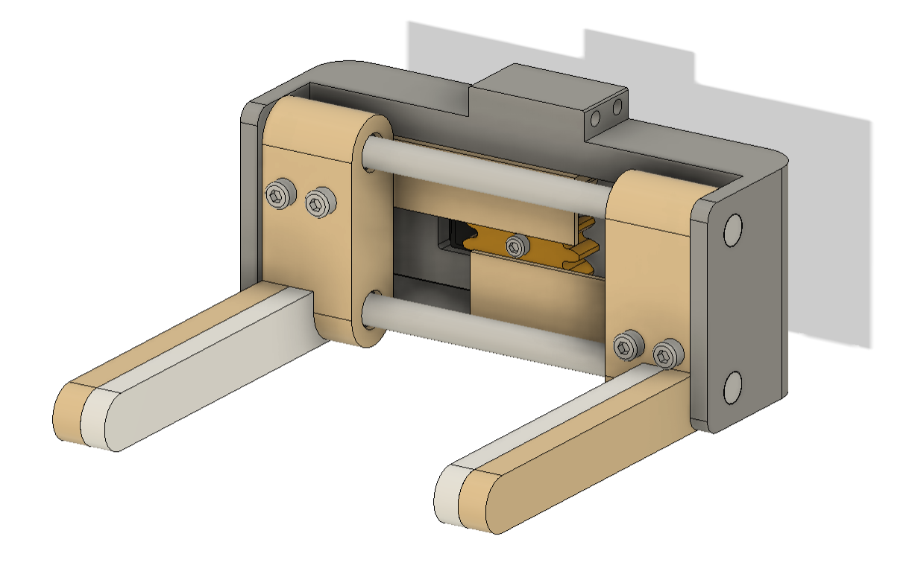

The gripper is the end-effector of the SCARA arm. It is designed to grasp, hold, transport, and release the Tower of Hanoi disks.

The selected system is a parallel-jaw gripper actuated by a rack-and-pinion mechanism. This design allows both jaws to move symmetrically, which helps keep the disks centered during grasping.

### Files to Laser Cut

No laser-cut parts are required for the gripper.

### Files to 3D Print (using the default PrusaSlicer settings unless specified otherwise)

- [Gripper frame](docs/CAD/Gripper/3D-print/PETG/Frame.stl)
- 2 racks & 1 pinion: [Right Rack](docs/CAD/Gripper/3D-print/PETG/Right-Rack.stl), [Left Rack](docs/CAD/Gripper/3D-print/PETG/Left-Rack.stl), [Pinion](docs/CAD/Gripper/3D-print/PETG/Pinion.stl); Print settings: Vertical Shells > Perimeters = 5
- 2 jaws: [Right Jaw](docs/CAD/Gripper/3D-print/PETG/Right-Jaw.stl), [Left Jaw](docs/CAD/Gripper/3D-print/PETG/Left-Jaw.stl)
- 2 TPU contact layers with disks: [Right-Jaw TPU Layer](docs/CAD/Gripper/3D-print/TPU/TPU-Layer-Right-Jaw.stl), [Left-Jaw TPU Layer](docs/CAD/Gripper/3D-print/TPU/TPU-Layer-Left-Jaw.stl); Print settings: Horizontal Shells > Solid Layers > Top = 0, Bottom = 4 / Infill = 25%

### Other Parts

| Part | Quantity | Specification / Notes |
|---|---:|---|
| DS3230MG servo motor | 1 |  |
| Aluminium guide rods | 2 | 8 mm diameter |
| LM8UU linear bearings | 4 | 8 mm × 12 mm × 19 mm |
| M4 screws and inserts | 4 each | To attach jaws to racks |
| M3 screws and inserts | 4 each | To attach gripper frame to arm |
| Metallic retaining rings | 4 | 8 mm diameter, serve as an additional safety measure to prevent the rods from sliding out of the frame |

### Assembly Procedure

### Assembly Procedure

1) 3D print the main frame, racks, pinion, and jaws in PETG, and print the 2 jaw contact layers in TPU.
2) Glue each TPU contact layer onto its corresponding inner jaw surface using strong glue (...).
3) In each jaw, insert 2 LM8UU linear bearings into the dedicated mounting holes
4) Now that the jaws are ready to be mounted, place the M4 threaded inserts into the dedicated holes of the racks and into the mounting holes at the back of the frame.
5) Mount the servo motor at the rear of the frame using M4 screws.
6) Install the 2 racks inside the internal guiding channels of the frame. Ensure they slide smoothly (lightly sand the channels if needed).
7) Glue the plastic servo hub into the pinion
8) Now that the servo hub and pinion are attached together, mount the servo hub onto the servo shaft while properly aligning the pinion teeth with the teeth of both racks.
9) Actuate the servo to verify that both racks move symmetrically in opposite directions.
10) Machine circular grooves at both ends of each aluminum guide rod to allow later the 4 retaining rings to be attached securely.
11) Insert the 2 aluminum guide rods through one side only of the frame
12) Slide both jaws onto the rods through their linear bearings, then pass the rods through the opposite side of the frame.
13) Now make sure that the jaws slide smoothly along the guide rods without excessive friction.
14) Fasten each jaw to its corresponding rack using M4 screws. The inner surfaces of the jaws should remain perfectly parallel to ensure stable and firm gripping of the disks.
15) Attach the 4 metallic retaining rings, one on each side of both rods.
16) Now that the gripper is assembled, test gripping each of the 5 disks with the servo actuated. Verify that the gripper opens sufficiently for the largest disk while still securely gripping the smallest one.
17) Place the 4 M3 threaded inserts into the dedicated mounting holes in the gripper’s top rectangular extrusion.
18) Mount the gripper onto the arm by fitting the rectangular extrusion into the dedicated 3D-printed arm interface and fastening it with M3 screws.

[Insert image of full gripper assembly.]

## Hanoi Platform and Camera Support

Hanoi Platform and Camera Support full assembly : [Full-Assembly-STEP-file](docs/CAD/Hanoi-Platform-Camera-Support/Assembly/HanoiPlatformandCameraSupport.step)

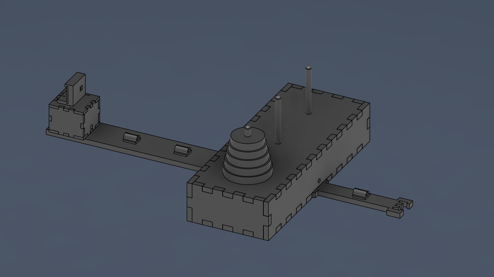

The Hanoi platform is the working environment of the robot. It holds the three pegs and the disks manipulated by the SCARA arm.

A camera support structure is integrated into the platform to provide a fixed overhead view of the puzzle. This fixed viewpoint helps the computer vision system detect the disk configuration more reliably.

### Files to Laser Cut

- Main Hanoi platform: [Top Box Face](docs/CAD/Hanoi-Platform-Camera-Support/Laser-cut/TopHanoiBox.dxf), [Bottom Box Face](docs/CAD/Hanoi-Platform-Camera-Support/Laser-cut/BottomHanoiBox.dxf), [Big Side Box Face x2](docs/CAD/Hanoi-Platform-Camera-Support/Laser-cut/BigSideHanoiBox.dxf), [Small Side Box Face x2](docs/CAD/Hanoi-Platform-Camera-Support/Laser-cut/SideSmallHanoiBox-2.dxf)
- Camera support box: [Top/Bottom Box Face](docs/CAD/Hanoi-Platform-Camera-Support/Laser-cut/TopBoxCamera-2.dxf), [Side Box Face with no cable holes x2](docs/CAD/Hanoi-Platform-Camera-Support/Laser-cut/SideFaceCameraNH.dxf), [Side Box Face with cable holes x2](docs/CAD/Hanoi-Platform-Camera-Support/Laser-cut/SideFaceCameraH-2.dxf)
- 2 box connectors: [Connector Scara-Hanoi](docs/CAD/Hanoi-Platform-Camera-Support/Laser-cut/LiaisonHanoi-Box.dxf), [Connector Hanoi-Camera](docs/CAD/Hanoi-Platform-Camera-Support/Laser-cut/LiaisonCamera-Hanoi.dxf)

### Files to 3D Print

- 5 Hanoi disks: [Disk 1](docs/CAD/Hanoi-Platform-Camera-Support/3D-print/Disks/Disk1.stl), [Disk 2](docs/CAD/Hanoi-Platform-Camera-Support/3D-print/Disks/Disk2.stl), [Disk 3](docs/CAD/Hanoi-Platform-Camera-Support/3D-print/Disks/Disk3.stl), [Disk 4](docs/CAD/Hanoi-Platform-Camera-Support/3D-print/Disks/Disk4.stl), [Disk 5](docs/CAD/Hanoi-Platform-Camera-Support/3D-print/Disks/Disk5.stl)
- Camera case: [Body](docs/CAD/Hanoi-Platform-Camera-Support/3D-print/Pegs/peg-head-body.stl), [Slider](docs/CAD/Hanoi-Platform-Camera-Support/3D-print/Camera/esp_slider.stl)
- Peg heads x3: [Body](docs/CAD/Hanoi-Platform-Camera-Support/3D-print/Pegs/peg-head-body.stl), [Top](docs/CAD/Hanoi-Platform-Camera-Support/3D-print/Pegs/peg-head-top.stl)
- [Cable Holder](docs/CAD/Hanoi-Platform-Camera-Support/3D-print/Box/cable_management.stl)

### Other Parts

| Part | Quantity | Specification / Notes |
|---|---:|---|
| Rods | 3 | 10 mm diameter, 8 mm inner diameter, used as pegs  |
| ESP32-CAM module | 1 |  |
| M3 Screws| As needed |  |
| MDF sheet| As needeed | We used 2, 10 mm for the hanoi box and connectors and 5mm for the camera box, but dimensions don't really matter|

### Disk Dimensions

The system uses 5 disks. Each disk has a height of 15 mm and a central hole of 14 mm diameter. The disk diameters range from 53 mm to 90 mm.

| Disk number | Diameter |
|---|---|
| 1 | 59 mm |
| 2 | 66 mm |
| 3 | 73 mm |
| 4 | 80 mm |
| 5, largest | 87 mm |

### Assembly Procedure

Laser cut the main platform and the camera support structure from MDF. Assemble the platform using the joints.

Install the three pegs into the platform. The pegs should be spaced 90 mm apart from center to center. Make sure that they are vertical and firmly fixed.

3D print the 5 disks. Each disk should slide freely on the pegs without excessive friction. The 14 mm central hole provides clearance around the 10 mm pegs.

Mount the camera case to its support box, which is itself mounted at the end of the Hanoi-camera connector. This connector keeps the ESP32-CAM at a fixed position relative to the Hanoi pegs, which improves repeatability during computer vision detection.

There are no predefined screw holes in the camera support box so that the camera angle can be adjusted manually during assembly and once the desired angle is found, the screw holes can be drilled directly in the box. Verify that all three pegs and the full disk area are visible in the camera frame.

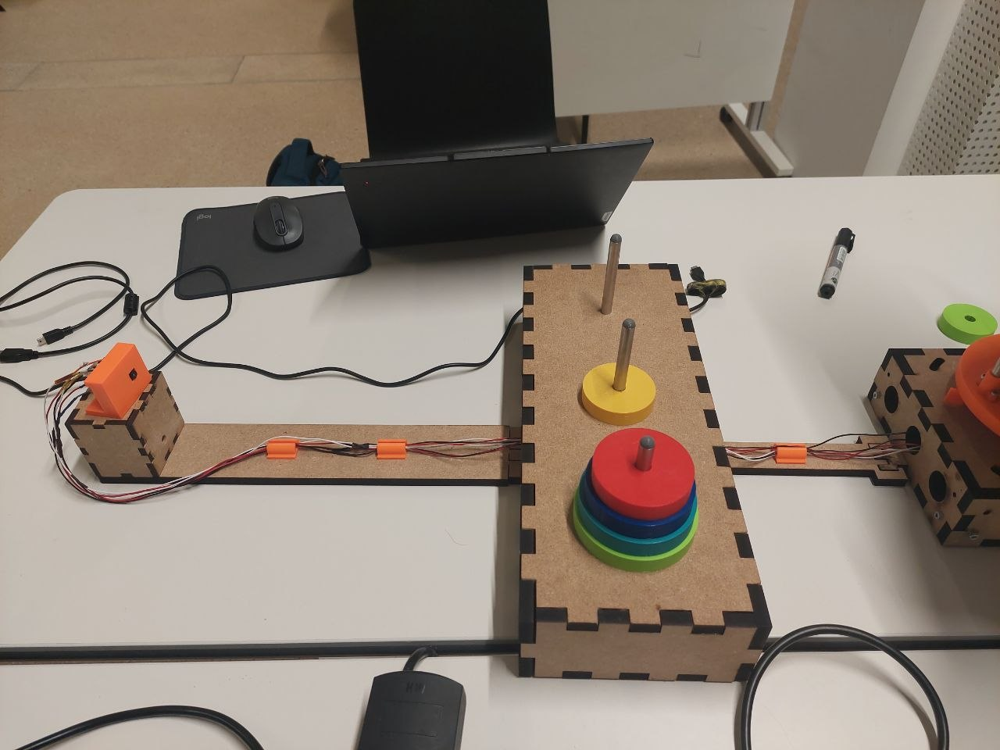


# Electronics

The entire system uses a 12V 10A DC power supply, which is plugged into a standard barrel jack. This jack is then wired to two connectors that distribute the power and regroup the common ground for three components: the RAMPS 1.4 board and two LM2596 buck converters. The buck converters are calibrated to regulate 5V and 7V for the EPS32-CAM and DS3230MG servo motor respectively.

The system is centered around an Arduino Mega 2560 with a RAMPS 1.4 board. The port of the Arduino is made accessible in order to upload code to it, while the RAMPS sits on top of it and handles all connections to other components. This includes the four A4988 stepper drivers, the cable to the NEMA 17 stepper motors themselves, the eight limit switches, the servo motor and the 8-channel logic-level converter. This converter is then connected to the ESP32-CAM to allow the serial communication with the Arduino/RAMPS system.

<p align="center">

</p>


### Full Electrical BOM

| Item | Quantity |
|---|---:|
| 12V, 10A DC power supply | 1 |
| Standard DC barrel jack | 1 |
| LM2596 buck converters | 2 |
| Arduino Mega 2560 | 1 |
| RAMPS 1.4 board | 1 |
| A4988 stepper drivers | 4 |
| NEMA 17 stepper motors | 4 |
| DS3230MG servo motor | 1 |
| Limit switches | 8 |
| ESP32-CAM | 1 |
| 8-channel logic-level converter | 1 |
| FTDI USB-to-TTL adapter for programming the ESP32-CAM | 1 |
| Mini USB-B to USB-A cable | 1 |
| Connectors | 2 |
| Wires, heat-shrink tubing | Multiple |

### Assembly Procedure

Start by gluing the barrel jack (to which you have soldered wires) to the right hole when looking at the electrical box from behind the arm (the left hole is the one where the holes for the Arduino Mega are). You can use a hot glue gun for this. Make sure that it’s accessible with the plug when the box is closed and that it’s stable enough to endure a lot of plugs and un-plugs. 

Prepare the buck converters by calibrating them and soldering pins to each in/out, +/- hole. Measure out and cut the cables you want to use for the connections.

Next, fix the RAMPS/Arduino and buck converters to the box by first gluing some small plastic spacers directly over each hole that will act as nuts for the M3 screws, which will then secure the components into place. For the logic converter, you can choose how to fix the 3D-printed holder to the box. A good option is to drill 1.5 mm holes and use small wood screws to secure it.

<p align="center">

</p>

You can now connect all wires from the two connectors.

After calibrating them, insert the A4988 drivers into the appropriate driver slots and verify their orientation before powering the board. Connect the NEMA 17 motors to the RAMPS motor outputs. Check the coil wiring carefully to avoid incorrect motor behavior.

Next prepare all limit switches by soldering a signal wire (S) to the NO pin of each switch, and a ground wire (GND) to the C pin of each switch. The other end of the wire should have a female connector pin (this can be soldered too). You can then mount them on each designated spot using M2 screws and nuts. Connect the limit switches to the RAMPS inputs. There are only six designed slots, but one can use the S and GND pins of remaining servo slots on the RAMPS and repurpose them in the firmware. 

Connect the servo motor to the dedicated 7 V buck converter, and connect the third signal wire to the designated slot on the RAMPS. Do not power the servo directly from the Arduino 5 V rail.

Connect the ESP32-CAM to the dedicated 5 V buck converter, and to the logic converter (RX/TX communication and 3V3/GND for reference). Then connect the logic converter to the RAMPS. Use the FTDI adapter for programming the EPS32-CAM. Again, do not power the servo directly from the Arduino 5 V rail.

Before powering the full system, verify all voltage rails with a multimeter:
- 12 V main input
- 7 V servo supply

<p align="center">

</p>

# Software

The software is split into three main parts. The browser interface is used to control the robot, preview the camera feed, run the Hanoi solver, and send commands. The ESP32-CAM acts as the Wi-Fi and camera bridge. The Arduino Mega, connected to the RAMPS 1.4 board, runs the low-level firmware that moves the motors.

```text
software/
├── index.html                  # Main browser interface
├── style.css                   # Interface styling
├── app.js                      # Manual control, workspace graph, command sending
├── config.js                   # ESP32 IP, robot dimensions, firmware commands
├── hanoi-solver.js             # Hanoi state validation, solver, and move queue
├── cv_server.py                # Flask/OpenCV bridge for the camera feed and detection
├── detectDisque.py             # Disk detection using OpenCV and HSV color masks
├── requirements.txt            # Python dependencies
├── esp32.ino                   # ESP32-CAM HTTP bridge and camera stream
├── custom-firmware.ino         # Arduino Mega + RAMPS custom motion firmware
├── axis-center.ino             # Helper code for measuring axis centers
├── command-descriptions.json   # Command descriptions shown in the UI
```

## Running the Interface

The browser interface is served by the local Python server. This server also handles the OpenCV processing, so the computer vision does not need to run directly inside the browser.

To install the Python dependencies:

```bash
cd software
pip install -r requirements.txt
```

To start the interface and connect it to the ESP32:

```bash
python cv_server.py --esp-ip <ESP32_IP>
```

Then open:

```text
http://localhost:5000
```

The ESP32 IP can also be changed directly from the interface.

## Browser Interface

<p align="center">
  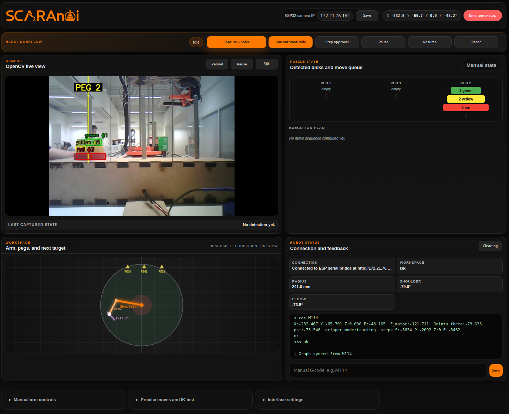
  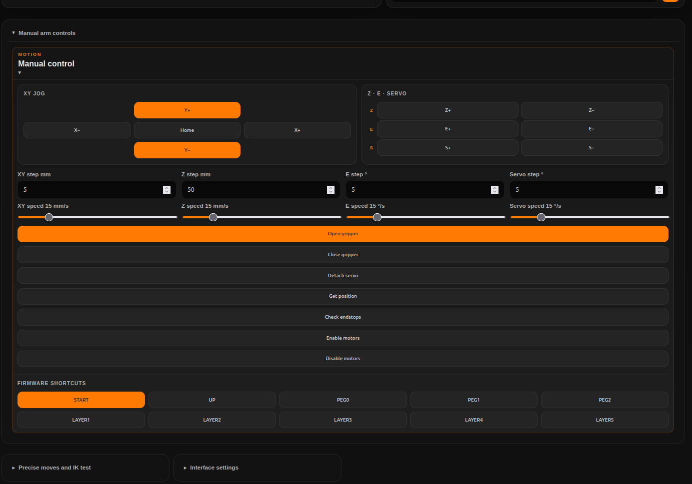
</p>

The browser interface is the main control panel of the robot. It provides manual arm control, absolute position control, camera preview, Hanoi state detection, solver controls, and command logs.

Commands are sent from the browser to the ESP32 using HTTP. The ESP32 then forwards them to the Arduino Mega through serial communication. This keeps the browser independent from the motor control details: the interface decides what command should be sent, while the firmware handles how the robot actually moves.

The interface also includes a top-down workspace graph. It shows the reachable area of the SCARA arm, the forbidden inner zone, the peg positions, and the current estimated position of the end effector. When the firmware returns a position with `M114`, the interface uses it to resync the graph with the real robot state.

## ESP32 Firmware

The ESP32-CAM is used as the bridge between the browser interface and the Arduino Mega. It receives HTTP requests from the interface, forwards the commands to the Arduino over UART, and sends the Arduino response back to the browser. It also provides the camera stream used by the OpenCV server.

The firmware is located in:

```text
software/esp32.ino
```

The ESP32 exposes these main endpoints:

```text
/send?msg=<command>   Send one or more commands to the Arduino
/capture              Capture one still image from the ESP32-CAM
:81/stream            MJPEG camera stream
```

For example, this sends an `M114` position request to the Arduino:

```text
http://<ESP32_IP>/send?msg=M114
```

In the current setup, the ESP32 connects to an existing Wi-Fi network and communicates with the Arduino Mega at baud rate `250000`.

## Arduino Firmware

The Arduino Mega is the low-level motion controller. It is connected to the RAMPS 1.4 board with A4988 stepper drivers. The firmware is custom-made for SCARAnoi and is located in:

```text
software/custom-firmware.ino
```

This firmware implements a smaller Marlin-like command set that is easier to adapt to our SCARA arm and to the specific movements needed for the Hanoi demo.

The firmware controls four axes:

- `X`: shoulder joint
- `Y`: elbow joint
- `Z`: vertical lift
- `E`: wrist / gripper rotation

The normal movement commands use Cartesian `X/Y` coordinates. Internally, the firmware uses inverse kinematics to convert these coordinates into the shoulder and elbow angles needed by the motors. The `Z` axis is controlled in millimeters, and the `E` axis is treated as a logical gripper angle.

The firmware also includes custom text commands for the Hanoi demo:

```text
START     Move to the configured start pose
PEG0      Move above peg 0
PEG1      Move above peg 1
PEG2      Move above peg 2
UP        Move to the safe height above the current peg
LAYER1    Move down to layer 1
LAYER2    Move down to layer 2
LAYER3    Move down to layer 3
LAYER4    Move down to layer 4
LAYER5    Move down to layer 5
OPEN      Open the gripper
CLOSE     Close the gripper
```

These macros keep the browser logic simpler. The browser only has to decide the logical Hanoi move, while the exact peg coordinates, Z heights, and gripper angles are stored in the firmware.

Common firmware commands include:

```text
G28              Home the robot
G90              Use absolute positioning
G91              Use relative positioning
G1 X.. Y.. Z..   Move to a position
G92 X.. Y.. Z..  Set the current logical position
M114             Report current position
M119             Report endstop states
M17              Enable motors
M18 / M84        Disable motors
M112             Emergency stop
M999             Clear emergency stop
M280 P0 S..      Move the gripper servo
M282 P0          Detach the servo
M503             Print firmware settings
```

# Motion

The motion system is based on a SCARA arm with a vertical lift and a servo gripper. A complete disk transfer consists of moving above a peg, going down to the correct disk layer, closing the gripper, lifting the disk, moving to another peg, and releasing it.

## Shoulder and Elbow Motion

The shoulder and elbow joints control the horizontal position of the gripper above the Hanoi platform. Instead of manually controlling the joint angles, the user gives target `X/Y` coordinates through the interface. The firmware then computes the corresponding SCARA angles using inverse kinematics.

This makes manual control easier because the user can think in terms of positions above the board, rather than individual motor angles.

## Z-Axis Motion

The Z-axis moves the gripper up and down. It is used to approach a disk, grab it, lift it above the pegs, and lower it again at the target position.

For the Hanoi demo, the firmware stores predefined Z heights:

```text
Z_UP      Safe height above the pegs
LAYER1    First disk layer
LAYER2    Second disk layer
LAYER3    Third disk layer
LAYER4    Fourth disk layer
LAYER5    Fifth disk layer
```

This avoids recalculating the vertical position in the browser for every move. The interface can simply send commands such as `UP` or `LAYER3`.

## Gripper Motion

The gripper is controlled by a servo motor. During the Hanoi sequence, the browser sends `OPEN` or `CLOSE`, and the firmware moves the servo to the configured angle.

For manual testing, the servo can also be controlled directly using `M280 P0 S<angle>`. The command `M282 P0` detaches the servo when needed.

## Homing and Limits

Before running a full Hanoi sequence, the robot should be homed with:

```text
G28
```

This gives the robot a known reference position. The firmware also uses endstops and software limits to avoid unsafe movement.

Useful debug commands are:

```text
M119    Check endstop states
M114    Check current position
M503    Print firmware settings
```

After homing, the interface requests the current position again so the workspace graph matches the firmware state.

# Computer Vision

The computer vision system detects the colored Hanoi disks from the ESP32-CAM image. The ESP32-CAM provides the raw stream, and the Python OpenCV server processes it locally.

The main files are:

```text
software/cv_server.py
software/detectDisque.py
```

The detection currently uses HSV color segmentation. Each disk has a known color, and the script detects the largest valid contour for each color. It then assigns each detected disk to a peg based on its position in the image and sorts the disks vertically to reconstruct the stack order.

The current disk convention is:

```text
1 = yellow disk, smallest
2 = red disk
3 = blue disk
4 = turquoise disk
5 = green disk, largest
```

The OpenCV server provides:

```text
/cv-stream      Annotated live stream
/cv-snapshot    Latest annotated frame
/detect         Latest detected Hanoi state as JSON
/set-esp        Update the ESP32 IP used by the CV server
```

The vision system is especially sensitive to camera angle, lighting, and background movement. For this reason, the detection should first be tested independently before running a full autonomous sequence.

# Hanoi Algorithm

The Hanoi solver is implemented in:

```text
software/hanoi-solver.js
```

It takes the detected or manually entered Hanoi state and computes the sequence of legal moves needed to solve the puzzle. The solver also supports partial setups, so it does not always require all five disks to be present.

The state is represented as three peg lists. Each disk is represented by its number, where smaller numbers are smaller disks. For example:

```text
Peg 0: [5, 4, 3]
Peg 1: []
Peg 2: []
```

Before solving, the state is checked to make sure it is legal. This prevents cases such as duplicate disks or a larger disk being placed on top of a smaller one.

Once the logical sequence is computed, each move is converted into firmware commands. A typical disk transfer follows this structure:

```text
Move above source peg
Go down to the source layer
Close the gripper
Move up
Move above target peg
Open the gripper
```

The browser can execute the sequence step by step with confirmation, or run it automatically one move after another. After each disk transfer, the system uses computer vision to compare the detected Hanoi state with the expected state. If they do not match, the sequence stops so the user can check the robot, the disks, or the camera detection before continuing.

# Autonomous Operation

The autonomous workflow combines camera detection, Hanoi planning, and robot execution.

The intended workflow is:

1. Start the ESP32-CAM bridge
2. Start the Python OpenCV server
3. Open the browser interface
4. Home the robot with `G28`
5. Detect the current Hanoi state
6. Compute the move sequence
7. Execute each disk transfer through the ESP32 bridge
8. Verify the state after each move
9. Continue until the puzzle is solved

The system can stop if the firmware does not acknowledge a command, if the detected state does not match the expected state, or if the user pauses the execution. This makes the autonomous mode safer during testing, especially while the camera detection is still being tuned.

# Manual Control

Manual control is used for testing, calibration, and debugging. It is also useful when checking if the ESP32, Arduino, motors, endstops, and gripper are communicating correctly.

The interface supports:

- XY jogging
- Z up and down movement
- Wrist rotation
- Servo open and close
- Absolute position moves
- Manual command sending
- Homing
- Position sync
- Endstop checks
- Emergency stop

The manual interface also shows command logs and firmware responses. This helps debug problems such as a disconnected ESP32, a missing Arduino response, an endstop problem, or a move being rejected by the firmware limits.

## Full Mechanical BOM

| Item | Quantity |
|---|---:|
| GT2 closed timing belt of length 350 mm | 1 |
| GT2 closed timing belt of length 400 mm | 3 |
| GT2 20T, 6 mm belt, 5 mm bore Pulley | 3 |
| TR8 Trapezoidal Nut Brass Pitch 8mm | 1 |
| TR8 400mm trapezoidal threaded spindle Pitch 8mm | 1 |
| Linear bearings 8mm | 8 |
| 8mm/5mm Flexible Aluminium Coupling with Dowel Screws | 1 |
| Deep Groove Ball Bearing 6200 2RS 10x30x9 mm | 4 |
| Deep Groove Ball Bearing 6906 / 61906 RS 30x47x9 mm | 1 |
| Miniature Deep Groove Ball Bearing 608 2RS 8x22x7 mm | 1 |
| Axial ball bearing 51110 50x70x14 mm | 2 |


# Top contributors:

This project was made by:

- Rania Hida ([@Rania5724](https://github.com/Rania5724))
- Mehdi Belhaj ([@mehdi754-hub](https://github.com/mehdi754-hub))
- Youssef Benhayoun Sadafi ([@youssef-9511](https://github.com/youssef-9511))
- Ozan Esref Sahingöz ([@ozan-sz](https://github.com/ozan-sz))
- Jonathan Nilsson Pilemand ([@JonathanPilemand](https://github.com/JonathanPilemand))
- Maha El Qabli ([@melqabli](https://github.com/melqabli))
- Davood Hashimi ([@Davood-H](https://github.com/Davood-H))
